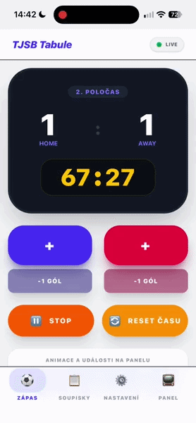

# TJSB Scoreboard

[](https://opensource.org/licenses/MIT)

A web application for remotely controlling an LED scoreboard over the internet.

The project was created as an independent alternative to the original proprietary control software. It allows the scoreboard to be controlled from any device with a web browser and supports multiple connected users.

## Preview



## Features

- Remote scoreboard control through a web interface
- Real-time synchronization between multiple connected users
- Automatic state recovery after restart
- Lineup and configuration management
- Progressive Web App (PWA) support
- REST API & User authentication
- Communication with the control hardware over RS-232
- Remote access through Cloudflare Tunnel

## How It Works

The application runs on a Raspberry Pi connected to the original scoreboard control hardware. The frontend provides the user interface for controlling the scoreboard, while the backend handles requests, maintains the current state, and communicates with the control hardware. WebSockets are used for real-time synchronization between connected clients.

## Tech Stack

- **Backend:** Python, FastAPI, SQLite, WebSockets
- **Frontend:** Vue.js, JavaScript, PWA
- **Hardware:** Raspberry Pi, RS-232
- **Infrastructure:** Cloudflare Tunnel

## Hardware

The project is designed to communicate with:

- **Manufacturer:** Satturn Holešov
- **Control unit:** RC3M-868-BT
- **Interface:** RS-232

## Reverse Engineering

In order to communicate with the existing hardware, the communication protocol used by the original control software first had to be understood.

The original Android and desktop applications were analyzed using reverse engineering techniques to determine how they communicate with the control hardware. The required communication protocol was then reconstructed based on this analysis.

This project is an independent implementation built entirely from scratch. It does not contain or use source code, decompiled code, binaries, graphical assets, or other proprietary components from the original applications. Reverse engineering was performed solely to understand the communication protocol required for interoperability with the existing hardware.

## Project Structure

```text
.
├── backend/        # FastAPI backend
├── frontend/       # Vue.js frontend
├── ...
├── pyproject.toml
└── uv.lock
```

## Installation

### Requirements

- Python `3.11.9`
- Node.js `v24.11.0`
- `uv`
- Listed Python and JS requirements

### Backend

```bash
uv sync
```

### Frontend

```bash
npm install
npm run build
```

### Configuration

Create a `.env` file based on the provided example:

```bash
cp backend/.env.example backend/.env
```

Then configure the required values in the new `.env` file.

## Running

Start the backend with:

```bash
python api.py
```

By default, the API listens on `127.0.0.1:8000` and uses `/dev/ttyUSB0` as the serial port.

**Available options:**

- `--mock` — run the API in mock mode without the scoreboard hardware
- `--port` — serial port (default: `/dev/ttyUSB0`)
- `--host` — API host (default: `127.0.0.1`)
- `--api-port` — API port (default: `8000`)

*Example: run in mock mode*
```bash
python api.py --mock
```

## License

This project is licensed under the MIT License.

The software is provided "as is", without warranty of any kind. See the `LICENSE` file for the full terms and conditions.

## Disclaimer

This project is an independent third-party implementation and is not affiliated with, endorsed by, or officially connected to the manufacturer of the scoreboard or the original control software.

All trademarks and product names mentioned in this repository belong to their respective owners.

The project is intended for interoperability with hardware that the author has legitimate access to. No proprietary source code or other proprietary software components are distributed as part of this project.